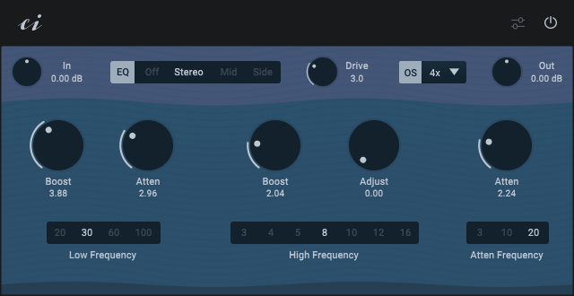

# Pult EQ
Pult EQ is a free and open source Pultec style tube EQ VST3 plugin (64bit) for Linux and Windows. Pult EQ is not made for fine detailed work, but for adding mojo and sound coloration. You can boost the lows, the highs and the mids. You can saturate your sound or, of course, do the “Pultec trick”. The EQ features stereo and mid/side processing and the saturation comes with automatic gain compensation and up to 16 times oversampling.

Pult EQ is based on the Pultec EQ example of the Wave Digital Filter model library in FAUST and on the airwindows Tube2 saturation.

## How to install
1. Unzip the downloaded file.
2. Copy the entire ‘Pult EQ.vst3’ or ‘Pult EQ’ folder into the vst folder of your operating system. For Linux, this is the .vst3 folder in the home directory. For Windows, this is in ‘C:\\Program Files\\Common Files\\VST3’.

## How to use
### General
Knobs can be adjusted by dragging. If you hold Ctrl or Alt while dragging, the knob can be fine-tuned. If you press Shift while clicking on a knob, you can enter a value as text.

### Interface
#### Bypass
Bypass the Plugin.

#### Settings
The ‘ci‘ logo or the settings icon shows and closes the settings.

#### In
Adjusts the input gain.

#### EQ
The EQ can be switched off here, set to stereo mode or to mid and side mode. If “Mid” is selected, the mid signal can be processed. If “Side” is selected, the side signal can be processed.

#### Drive
Sets the level of saturation. At 0, the saturation is completely switched off.

#### OS - Oversampling
Adjusts the oversampling.

#### Out
Adjusts the output gain.

#### EQ
The EQ is basically divided into two areas: the low frequencies and the high frequencies.

The left ‘Boost’ and ‘Atten’ knobs and the ‘Low Frequency’ selection are responsible for the low frequencies. ‘Low Frequency’ can be used to set the effective range of the low frequency band, even if this extends far beyond the specified value. The low boost knob can be used to boost the low frequencies. The low Atten knob can be used to reduce the low frequencies. If the low frequencies are boosted and attenuated at the same time, interesting EQ curves are created which make up the so-called Pultec EQ trick.

All other knobs are used for the high frequencies. With ‘High Frequency’ and ‘Atten Frequency’ there are two separate frequency settings for the high boost and the high attenuation. The ‘Adjust’ knob can also be used to set the bandwidth of the high boost.

### Settings
#### Zoom Factor
Sets the size of the UI.

#### Oversampling Filter
The ‘Polyphase’ filter has a low latency but some phase distortion in the high frequencies. The ‘FIR’ filter is phase linear but has a higher latency.

## How to compile
1. Install or compile [Faust](https://github.com/grame-cncm/faust) > 2.74.6
2. Compile [Hise](https://github.com/christophhart/HISE) with Faust enabled (see https://forum.hise.audio/topic/6746/updated-build-instructions). For help you can watch the great videos by David Healey ([Linux](https://www.youtube.com/watch?v=rUuEoJk6FF8), [Windows](https://www.youtube.com/watch?v=D3kthNOQ9_s), [MacOS](https://www.youtube.com/watch?v=zeLeCSNh0XM)).
3. Clone this repository or download the Pult EQ source code.
4. Open Hise, select ‘File -> Load Project’ and select the Pult EQ folder.
5. Go to ‘Export’ and select ‘Compile DSP Networks as dll’. On Windows this will compile the DSP Networks. On Linux you have to execute the file ‘.../Pult EQ/DspNetworks/Binaries/batchCompileLinux.sh’ in the terminal.
6. Restart Hise and load the file ‘pulteq.xml’.
7. Select ‘Export -> Export as FX plugin’. 
8. On Windows this will compile the Plugin. On Linux you have to execute the file ‘.../Pult EQ/Binaries/batchCompileLinux.sh’ in the terminal.

If you need help you can ask me or have a look at the great [Hise forum](https://forum.hise.audio/).

## Credits
Many thanks to Christoph Hart for making [Hise](https://github.com/christophhart/HISE). Thanks to David Healey for the great [Hise tutorials](https://www.youtube.com/@DHealey/featured). Thanks to the whole [Hise forum](https://forum.hise.audio/) for the friendly interaction and the great mutual help and support.

Thanks to the whole FAUST team for making [FAUST](https://github.com/grame-cncm/faust) and to [droosenb](https://github.com/droosenb) for adding the [wdmodels library](https://faustlibraries.grame.fr/libs/wdmodels/) and the Pultec example.

Thanks to [Chris from Airwindows](https://github.com/airwindows/airwindows) for [Tube2](https://www.airwindows.com/tube2/) and all the other great algorithms.

The plugin background is based on a SVG background from [svgbackgrounds.com](https://www.svgbackgrounds.com/set/free-svg-backgrounds-and-patterns/)